# Python Task 3: Shorten URL

Сервис реализован на фремворке FastAPI с подключением к базе данных PostgreSQL и кэшированием с помощью Redis.

## Инструкция по запуску сервиса:

1. Клонировать [репозиторий](https://github.com/PalaginID/PythonTask3)

2. Создать файл `.env` и заполнить его переменными окружения:
    - `DB_USER`
    - `DB_PASSWORD`
    - `DB_HOST`
    - `DB_PORT` в формате string
    - `DB_NAME`
    - `DB_DATA`=/fastapi_app/db
    - `DB_URL`=postgresql+asyncpg://`DB_USER`:`DB_PASSWORD`@`DB_HOST`:`DB_PORT`/`DB_NAME`

3. Выполнить команду `docker-compose up --build`

4. Открыть Swagger UI по адресу `http://localhost:9999/docs`

## Описание базы данных:

### Описание таблиц:

- `users` - таблица пользователей
    - id: UUID - id пользователя;
    - email: String - email пользователя;
    - hashed_password: String - закодированный пароль;
    - registered_at: TIMESTAMP - время регистрации;
    - is_active: Boolean - является ли пользователь активным;
    - is_superuser: Boolean - является ли пользователь суперпользователем;
    - is_verified: Boolean - верифицирован ли пользователь;
    - is_premium: Boolean - является ли пользователь премиум аккаунтом;

- `links` - таблица сокращенных ссылок
    - id: Integer - id сокращенной ссылки;
    - short_code: String - сокращенная ссылка;
    - original_url: String - оригинальная ссылка;
    - created_at: DateTime - время создания;
    - expires_at: DateTime - время истечения срока действия;
    - clicks: Integer - количество обращений по ссылке;
    - last_accessed: DateTime - время последнего обращения;
    - owner_id: UUID - id пользователя, владеющего ссылкой;

- `queries` - таблица истории обращений к ссылке
    - id: Integer - id записи;
    - link_id: Integer - id ссылки;
    - user_id: UUID - id пользователя;
    - short_code: String - сокращенная ссылка;
    - original_url: String - оригинальная ссылка;
    - accessed_at: TIMESTAMP - время обращения;
    
### Описание схем:

- UserRead - стандартная схема BaseUser из библиотеки fastapi_users:
    - email: String - email пользователя;
    
- UserCreate - стандартная схема BaseUserCreate из библиотеки fastapi_users:
    - email: String - email пользователя;
    - password: String - пароль пользователя;

- LinkCreate - схема для создания сокращенной ссылки:
    - original_link: String - оригинальная ссылка;
    - custom_alias: Optional[String] - сокращенная ссылка;
    - expires_at: Optional[String] - время истечения срока действия;

## Описание API:

### Авторизация:

- Регистрация пользователя: `POST /auth/register`
- Авторизация пользователя: `POST /auth/jwt/login`
- Выход пользователя: `POST /auth/jwt/logout`

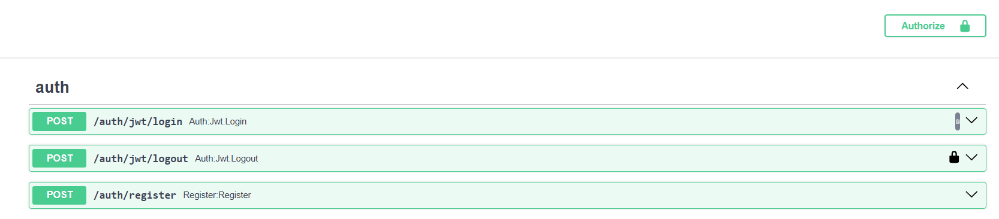

### Основной функционал:

- Сокращение URL: `POST /links/shorten`
- Поиск по сокращению: `GET /links/search`
- Переход по сокращению: `GET /links/{short_url}`
- Замена сокращения: `PUT /links/{short_url}`
- Удаление сокращения: `DELETE /links/{short_url}`
- Статистика сокращения: `GET /links/{short_url}/stats`
- Статистика устаревшего сокращения: `GET /links/expired_stats`

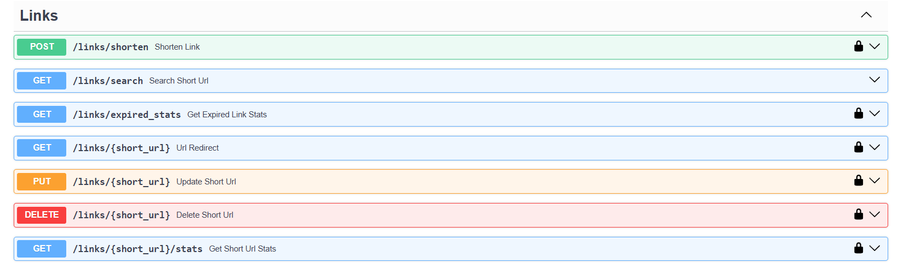

### Премиум функционал:

- Переключение на премиум аккаунт: `PUT /premium/premium`
- Статистика сокращения: `GET /premium/{short_url}/stats`
- Статистика устаревшего сокращения: `GET /premium/expired_stats`
- История обращений к ссылке: `GET /premium/{short_url}/queries`

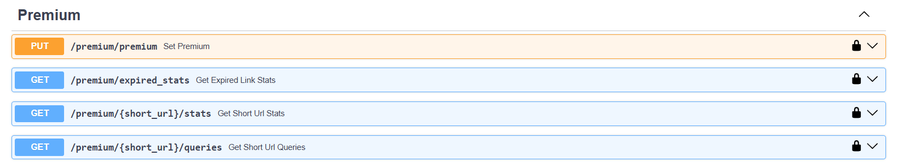

## Примеры запросов:

### Регистрация пользователя:

```
POST /auth/register
{
  "email": "string",
  "password": "string",
  "is_active": true,
  "is_superuser": false,
  "is_verified": false
}
```

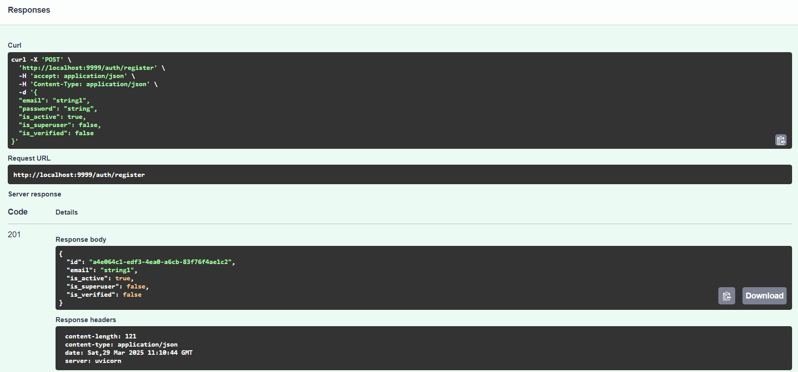

#### Возможные ответы сервера:

- 201 - пользователь успешно зарегистрирован;
- 400 - пользователь с таким email уже существует;
- 422 - ошибка валидации данных;

### Авторизация пользователя:

```
POST /auth/jwt/login
{
    "username": "string",
    "password": "string"
}
```

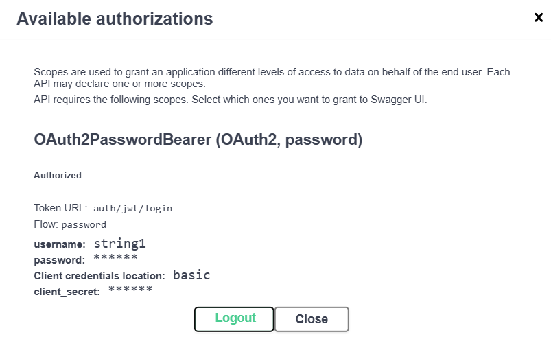

#### Возможные ответы сервера:

- 200 - пользователь успешно авторизован;
- 400 - неверные данные для авторизации;
- 422 - ошибка валидации данных;

#### Важная просьба: производить авторизацию пользователя с помощью кнопки в правом верхнем углу экрана.

### Выход пользователя:

```
POST /auth/jwt/logout
```

#### Возможные ответы сервера:

- 201 - пользователь успешно вышел из системы;
- 401 - пользователь не авторизован;

### Сокращение URL:

#### Информация о запросе:

- original_link - оригинальная ссылка;
- custom_alias - сокращенная ссылка (необязательно), может содержать только латинские буквы, цифры и символы -, _;
- expires_at - время истечения срока действия (необязательно) в формате YYYY-MM-DD HH:MM, YYYY-MM-DD HH или YYYY-MM-DD;

```
POST /links/shorten
{
    "original_link": "string",
    "custom_alias": "string",
    "expires_at": "string"
}
```


#### Возможные ответы сервера:

- 200 - сокращенная ссылка успешно создана;
- 400 - неверный формат expires_at, указанный custom_alias уже существует или передан в неверном формате;
- 500 - проблема на стороне сервера;

### Поиск по сокращению:

#### Информация о запросе:

- original_url - оригинальная ссылка;

```
GET /links/search
{
    "original_url": "string"
}
```


#### Возможные ответы сервера:

- 200 - успешно найдена/-ы сокращенная-ые ссылка/-ы;
- 404 - оригинальная ссылка не найдена;

### Переход по сокращению:

#### Информация о запросе:

- short_url - сокращенная ссылка;

```
GET /links/{short_url}
```

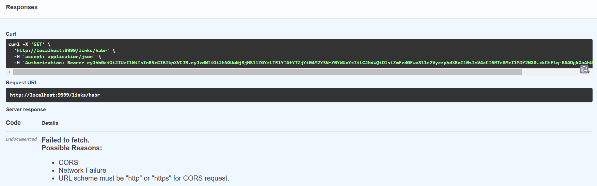

#### Возможные ответы сервера:

- 307 - перенаправление на оригинальную ссылку;
- 404 - сокращенная ссылка не найдена;
- 410 - у сокращенной ссылки истек срок действия;
- 500 - проблема на стороне сервера;

### Замена сокращения:

#### Информация о запросе:

- short_url - текущая сокращенная ссылка;
- custom_alias - новое сокращенное имя;

```
PUT /links/{short_url}
{
    "short_url": "string",
    "custom_alias": "string"
}
```

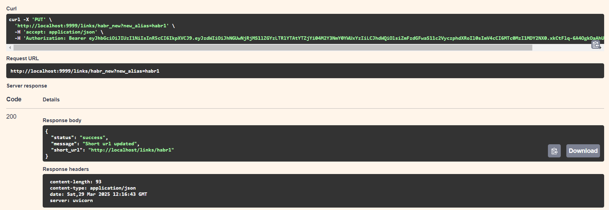

#### Возможные ответы сервера:

- 200 - сокращенное имя успешно заменено;
- 400 - неверный формат custom_alias;
- 403 - пользователь не авторизован или нет прав на замену сокращенного имени;
- 404 - сокращенная ссылка не найдена;
- 500 - проблема на стороне сервера;

### Удаление сокращения:

#### Информация о запросе:

- short_url - сокращенная ссылка;

```
DELETE /links/{short_url}
{
    "short_url": "string"
}
```

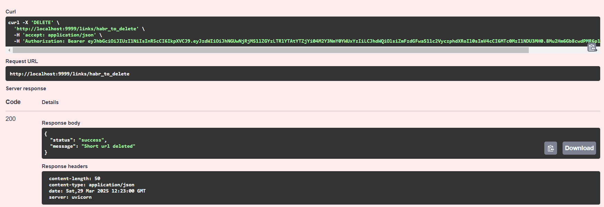

#### Возможные ответы сервера:

- 200 - сокращенная ссылка успешно удалена;
- 403 - пользователь не авторизован или нет прав на удаление сокращенной ссылки;
- 404 - сокращенная ссылка не найдена;
- 500 - проблема на стороне сервера;

### Статистика сокращения:

#### Информация о запросе:

- short_url - сокращенная ссылка;

```
GET /links/{short_url}/stats
{
    "short_url": "string"
}
```


#### Возможные ответы сервера:

- 200 - статистика успешно получена;
- 403 - пользователь не авторизован или нет прав на просмотр статистики;
- 404 - сокращенная ссылка не найдена или истек срок действия;
- 500 - проблема на стороне сервера;

### Статистика устаревшего сокращения:

#### Информация о запросе:

- возвращает статистику каждого устаревшего сокращения;

```
GET /links/expired_stats
```

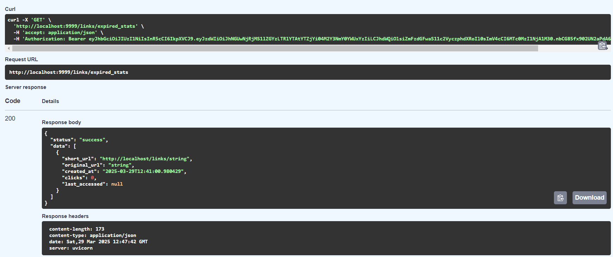

#### Возможные ответы сервера:

- 200 - статистика успешно получена;
- 403 - пользователь не авторизован;
- 404 - устаревшие сокращенные ссылки не найдены;

### Переключение на премиум аккаунт:

#### Информация о запросе:

- осуществляет переключение на премиум/базовый аккаунт;

```
PUT /premium/premium
{
    "status": boolean
}
```

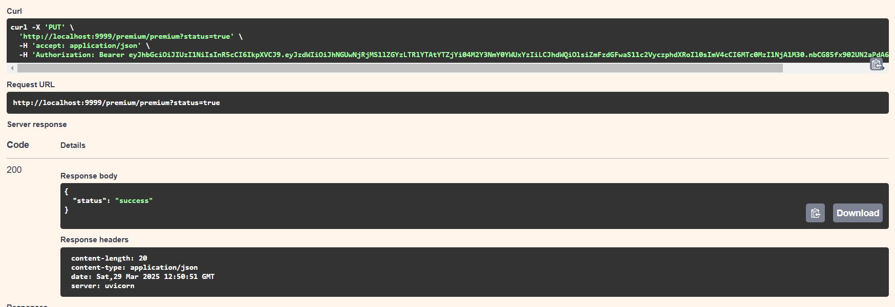

#### Возможные ответы сервера:

- 200 - переключение успешно выполнено;
- 403 - пользователь не авторизован;

### Премиум статистика устаревшего сокращения:

#### Информация о запросе:

- премиум пользователи могут получать статистику не только по своим сокращенным ссылкам, но и по чужим;

```
GET /premium/expired_stats
```

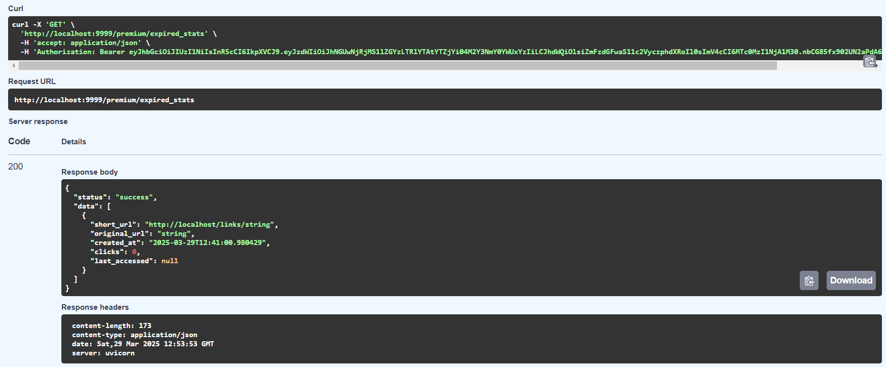

#### Возможные ответы сервера:

- 200 - статистика успешно получена;
- 403 - пользователь не авторизован или не является премиум аккаунтом;
- 404 - устаревшие сокращенные ссылки не найдены;

### Премиум статистика сокращения:

#### Информация о запросе:

- премиум пользователи могут получать статистику не только по своим сокращенным ссылкам, но и по чужим;

```
GET /premium/{short_url}/stats
{
    "short_url": "string"
}
```

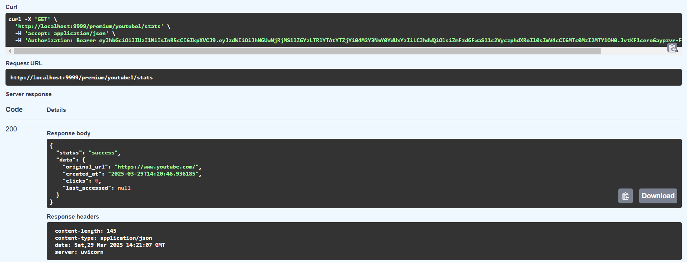

#### Возможные ответы сервера:

- 200 - статистика успешно получена;
- 403 - пользователь не авторизован или не является премиум аккаунтом;
- 404 - сокращенная ссылка не найдена;

### Список обращений к сокращенной ссылке:

#### Информация о запросе:

- премиум пользователи могут получать список обращений к сокращенным ссылкам;

```
GET /premium/{short_url}/queries
{
    "short_url": "string"
}
```

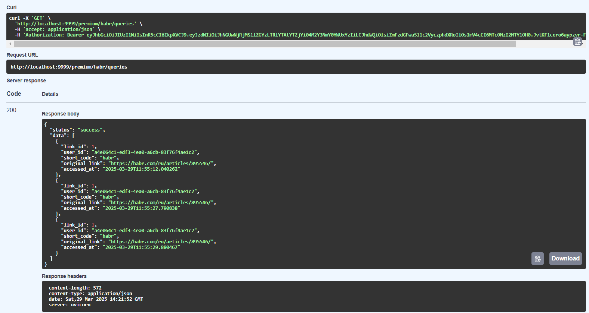

#### Возможные ответы сервера:

- 200 - список обращений к сокращенной ссылке успешно получен;
- 403 - пользователь не авторизован или не является премиум аккаунтом;
- 404 - сокращенная ссылка не найдена;

## Демо

### Авторизация, login, logout


### Создание ссылки, поиск ссылки и перенаправление неавторизованным пользователем


### Создание ссылки, изменение короткой ссылки авторизованным пользователем


### Создание просроченной ссылки, получение статистики по просроченной ссылке и по обычной, удаление ссылки авторизованным пользователем


### Переключение на премиум аккаунт, получение статистики по запросам и просроченным и обычным ссылкам премиум пользователем


# Тестирование

## Unit-тестирование (см. unit_test.py)

В этот раздел попали функции для проверки валидности оригинальной ссылки, введенных короткого названия и даты.

## Функциональное тестирование

В данном разделе тестировались эндпоинты:

- С помощью тестов в файле api_test.py был протестирован весь функционал API-сервиса, с различиными входными данными, а также для различных пользователей;
- С помощью фикстур в файле conftest.py производилось мокирование кэширования и использования базы данных, а также реализованы модели 3 видов пользователей: анонимный, стандартный и премиум;
- Процент покрытия составил 95% (для более подробной информации откройте htmlcov/index.html). Оставшиеся 5% приходятся на ошибки сервера (status cdode = 500), которые нельзя прописать в тесте.

```На случай, если решите запустить тесты сначала будет необходимо в файлах main.py, auth/users.py, auth/database.py, routers/user.py, routers/premium.py добавить "src." в импорты из других файлов. Я так и не понял почему это происходит, но при запуске тестирования он требует, чтобы было прописано src., а при запуске docker-compose up --build - наоборот```

## Нагрузочное тестирование

Тесты прописаны в файле locust.py. Тестирование проводилось на протяжении 5 минут с использованием 5 пользователей. Ошибок получено не было (для более подробного отчета откройте locust.html).

Нагрузочное тестирование автоматически запускается при docker-compose, необходимо перейти по ссылке http://localhost:8089, указать количество пользователей и скорость их появления и нажать start.